## Reading Between the Lines: How Much Information Remains After Fitting a Stellar Spectrum?

**An audit of the information remaining in 7087 GALAH spectra after subtracting their best-fitting stellar models.**

Authors: Sven Buder (ANU), Tomasz Różánski (ANU), David W. Hogg (CCA, MPIA, NYU)

> **Manuscript to be submitted to *The Open Journal of Astrophysics***

Quicklinks: [Residual-peak catalogue](data/peak_inspection_table.fits) · [Individual peak diagnostics](residual_inspection/) · [Paper figures](figures/)

## Abstract

What if we could model $100\,\%$ of a stellar spectrum? Modern surveys infer stellar properties by comparing observed spectra with synthetic models, yet even the best fits leave structured residuals. We analyse 7087 GALAH spectra and ask what information remains after subtracting each best-fitting model. Across 99 million residual pixels, 4.6 million exceed $3\sigma$, far above the 0.3 million expected from Gaussian noise. We map the amplitude, significance, sign, and recurrence of these residuals and identify 380 significant regions. Comparison with stellar atlases, line lists, diffuse interstellar bands, and sky diagnostics links most regions to plausible causes: $63\,\%$ are candidate line-strength or line-profile mismatches, while others trace missing or unidentified lines, interstellar absorption, sky emission, or broader reduction structure. We then train data-driven models on the residual spectra themselves. Residual-only models recover $T_\mathrm{eff}$ to $80-150\,\mathrm{K}$ and $[\mathrm{Fe/H}]$ to $0.059-0.086\,\mathrm{dex}$, depending on sample quality, and retain weaker, partly indirect information about elemental abundances. Extinction-related coefficients recover the strongest known interstellar features, whereas chromospheric activity leaves plausible Balmer-line signatures but is not recovered robustly out of sample. Most strikingly, the $6\,\%$ of pixels excluded from the GALAH optimisation recover stellar labels almost as well as the full residual spectrum and better than the remaining $94\,\%$ alone. Residuals are therefore not merely imperfections to discard: they map missing line data, incomplete physics, unfitted astrophysical components, and observational systematics. Reading between the lines turns one spectroscopist's trash into another one's treasure, and provides a practical route toward extracting more of the information already present in stellar spectra.

<!-- ## Key results

### 1. The residuals are structured and recurrent

Residuals are found throughout all four GALAH wavelength bands. Many occur repeatedly across the sample and preferentially in one direction: either the observed spectra are systematically deeper than the synthesis, indicating missing or underestimated absorption, or systematically shallower, indicating overestimated absorption or effects such as line-core emission and reduction systematics.

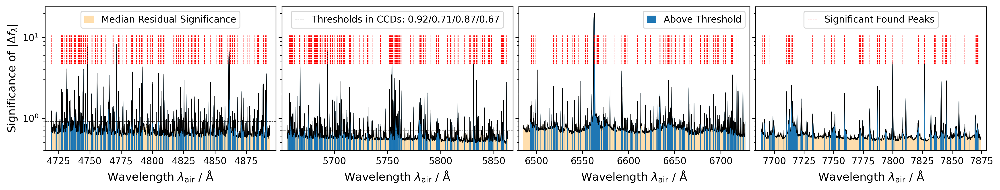

The direction of each residual helps distinguish missing opacity from excessive modelled absorption and from observational effects.

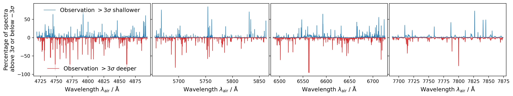

### 2. Residual spectra still know which stars they came from

We trained a quadratic model with **The Cannon** on the residual spectra and evaluated it using five-fold cross-validation. Despite the original stellar models already having been optimised for these labels, the residuals alone recover substantial information about effective temperature, surface gravity, and metallicity.

<p align="center">
  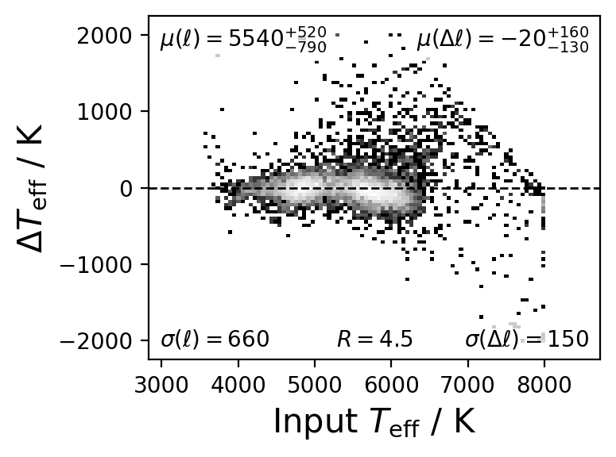
  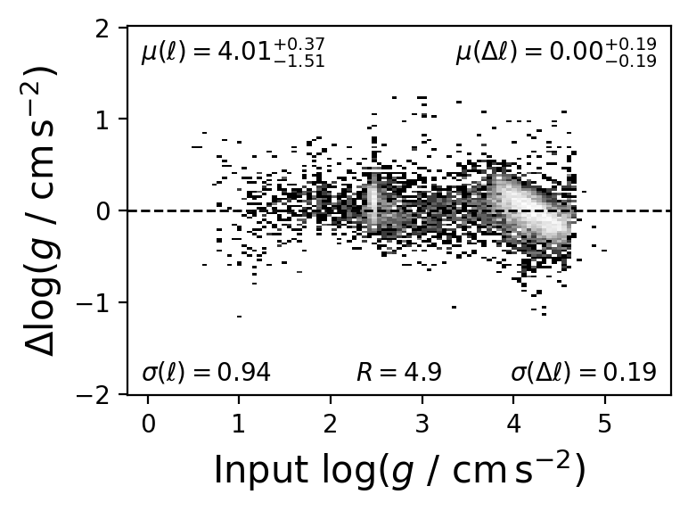
  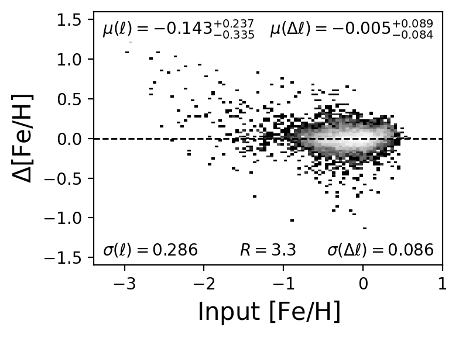
</p>

For the baseline sample, the robust out-of-sample recovery scales are approximately:

| Label                 | Recovery scale | Sample spread |
| --------------------- | -------------: | ------------: |
| Effective temperature |          150 K |         660 K |
| Surface gravity       |       0.19 dex |      0.94 dex |
| Metallicity           |      0.086 dex |     0.286 dex |

The residuals also retain information about individual elemental abundances and interstellar extinction.

### 3. Pixels excluded from the original fit are especially informative

GALAH DR4 excluded 793 wavelength pixels from its stellar-label optimisation because these regions were considered less reliable or more strongly affected by model–data disagreement. These pixels make up only approximately 6% of the available spectrum, yet they recover almost as much stellar-parameter information as the complete residual spectrum.

<table>
  <thead>
    <tr>
      <th>Label</th>
      <th>793 pixels excluded from the optimisation</th>
      <th>13,134 pixels included in the optimisation</th>
    </tr>
  </thead>
  <tbody>
    <tr>
      <td>Effective temperature</td>
      <td>
        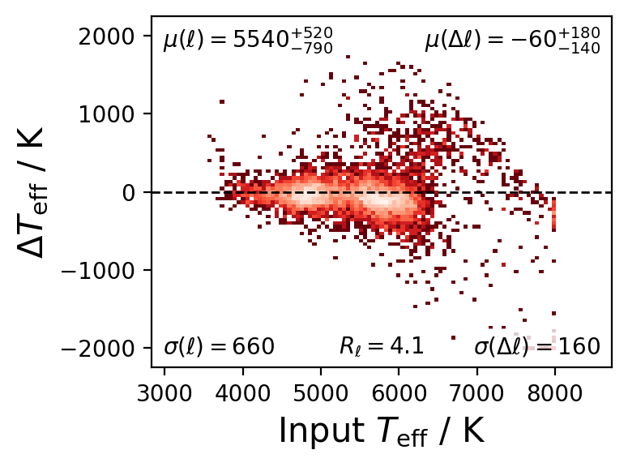
      </td>
      <td>
        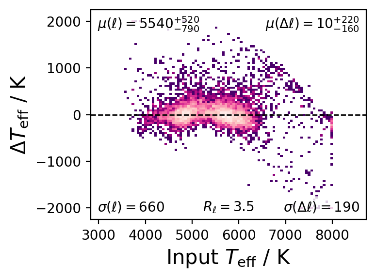
      </td>
    </tr>
    <tr>
      <td>Surface gravity</td>
      <td>
        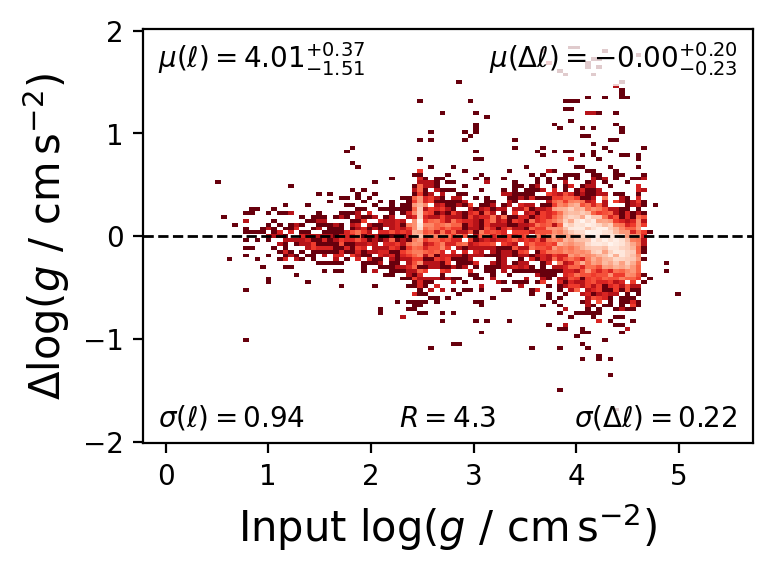
      </td>
      <td>
        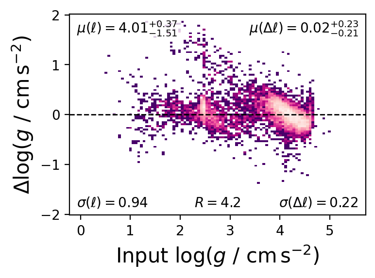
      </td>
    </tr>
    <tr>
      <td>Metallicity</td>
      <td>
        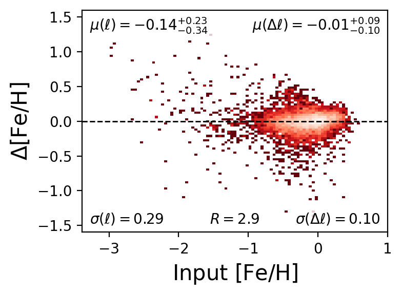
      </td>
      <td>
        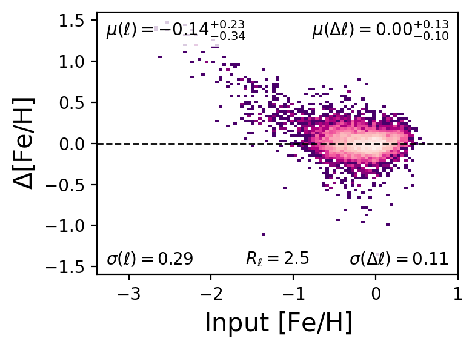
      </td>
    </tr>
  </tbody>
</table>

The excluded pixels outperform the much larger set of optimisation pixels for all three labels. This indicates that stellar information is concentrated precisely where the physical synthesis leaves its largest systematic mismatches.

### 4. The residual catalogue identifies actionable modelling problems

We identify recurrent residual peaks and compare them with Solar and Arcturus atlases, the GALAH line list, diffuse interstellar bands, telluric absorption, and sky-emission measurements.


The catalogue includes candidate cases of:

* underestimated or missing stellar absorption;
* overestimated line strengths;
* line-formation limitations;
* interstellar absorption;
* telluric, sky, or reduction residuals;
* unidentified stellar features;
* ambiguous or blended residuals.

These classifications are intended as plausibility assessments rather than definitive identifications. The sign and morphology of each residual nevertheless often indicate how the spectral model would need to change.


## Repository contents

| Path                                                                 | Description                                                                                                                              |
| -------------------------------------------------------------------- | ---------------------------------------------------------------------------------------------------------------------------------------- |
| [`data/peak_inspection_table.fits`](data/peak_inspection_table.fits) | Full machine-readable catalogue of significant residual regions, including classifications and inspection comments.                      |
| [`residual_inspection/`](residual_inspection/)                       | Detailed diagnostic figure for every inspected residual region.                                                                          |
| [`figures/`](figures/)                                               | Main paper figures and additional recovery and coefficient plots.                                                                        |
| Analysis scripts and notebooks                                       | Code used to calculate the residual statistics, identify significant regions, train the residual Cannon models, and produce the figures. |

The diagnostic figures in `residual_inspection/` combine the residual morphology with the available stellar, atomic, interstellar, telluric, and sky-emission information. They are intended both to document the classifications and to support further investigation of individual features. -->

## Main results

### 1. The residuals are not random

Residual structure is present throughout all four GALAH wavelength bands. Many residuals recur across a large fraction of the sample and are preferentially signed.

Observed spectra that are systematically deeper than the synthesis point towards missing or underestimated opacity, omitted blends, or inaccurate line-formation physics. Observed spectra that are systematically shallower can indicate overestimated opacity, line-core emission, continuum-normalisation errors, or reduction artefacts.


The direction of the residual provides information about how the spectral model would need to change.


### 2. Residual spectra retain information

We trained a quadratic model with **The Cannon** to test whether the residual spectra still contain information about the stellar labels used to construct the original synthesis.

All results were evaluated using five-fold cross-validation: each model was trained on 80% of the spectra and evaluated on the remaining 20%, such that every spectrum was evaluated out of sample exactly once.

<p align="center">
  
  
  
</p>

The complete residual spectrum recovers:

| Stellar label         | Out-of-sample recovery scale | Label spread in the sample |
| --------------------- | ---------------------------: | -------------------------: |
| Effective temperature |                        150 K |                      660 K |
| Surface gravity       |                     0.19 dex |                   0.94 dex |
| Metallicity           |                    0.086 dex |                  0.286 dex |

The residuals also retain information about individual elemental abundances and interstellar extinction. The current activity model identifies genuine activity-sensitive features, particularly Hα and Hβ, but does not yet recover the activity indicator robustly out of sample.


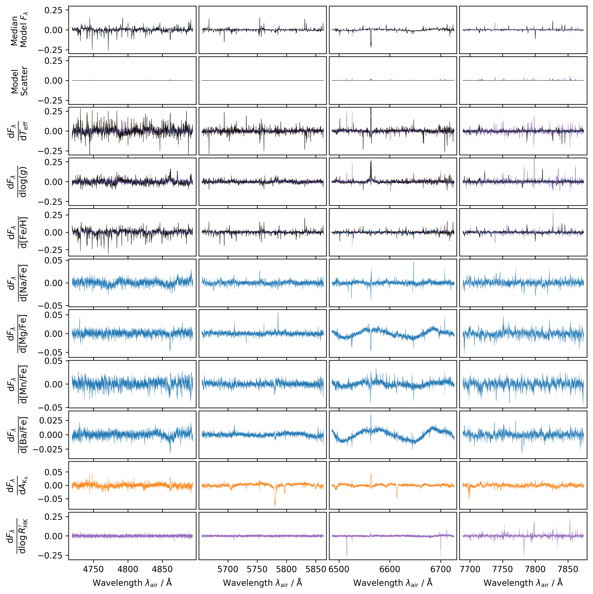

### 3. The excluded pixels contain disproportionately strong information

GALAH excluded 793 wavelength pixels from its final stellar-label optimisation because these regions were considered less reliable or more strongly affected by model–data disagreement.

Although these pixels account for only approximately 6% of the available spectrum, they recover almost as much stellar-parameter information as the complete residual spectrum. They also outperform the remaining 13,134 optimisation pixels for all three global stellar labels.

<table>
  <thead>
    <tr>
      <th>Label</th>
      <th>793 pixels excluded from the optimisation</th>
      <th>13,134 pixels included in the optimisation</th>
    </tr>
  </thead>
  <tbody>
    <tr>
      <td>Effective temperature</td>
      <td>
        
      </td>
      <td>
        
      </td>
    </tr>
    <tr>
      <td>Surface gravity</td>
      <td>
        
      </td>
      <td>
        
      </td>
    </tr>
    <tr>
      <td>Metallicity</td>
      <td>
        
      </td>
      <td>
        
      </td>
    </tr>
  </tbody>
</table>

The corresponding recovery scales are:

| Stellar label         | Complete spectrum | Excluded pixels | Optimisation pixels |
| --------------------- | ----------------: | --------------: | ------------------: |
| Effective temperature |             150 K |           160 K |               190 K |
| Surface gravity       |          0.19 dex |        0.22 dex |            0.22 dex |
| Metallicity           |         0.086 dex |       0.095 dex |            0.12 dex |

The excluded-pixel model uses approximately 17 times fewer pixels than the optimisation-pixel model. The number of pixels is therefore not a useful proxy for the information remaining in a residual spectrum.

### 4. The catalogue maps recurrent residual structure

We identified and visually inspected 380 recurrent residual regions. Each region was assigned a primary classification using its wavelength, width, recurrence, residual direction, and proximity to features in stellar atlases, the GALAH line list, catalogues of diffuse interstellar bands, telluric absorption, and sky-emission spectra.

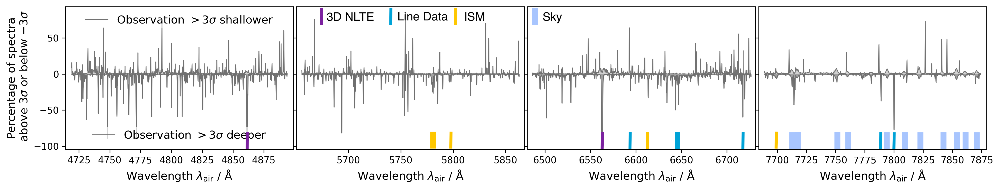

The adopted classifications include:

* transition strengths that are probably too high;
* transition strengths that are probably too low;
* line-profile or line-formation mismatches;
* known transitions missing from the synthesis;
* unidentified absorption features;
* interstellar absorption;
* sky-emission residuals;
* insignificant residuals;
* ambiguous or blended regions.

These classifications are plausibility assessments rather than definitive identifications. Nevertheless, the sign and morphology of a residual often indicate directly how the physical model or input line data would need to change.

### 5. Representative residual regions

The following examples illustrate the nine main classifications used in the catalogue. Each diagnostic combines the GALAH residual statistics with relevant external information, including Solar and Arcturus spectra, GALAH line-list entries, telluric absorption, and sky-emission measurements.

<table>
  <tr>
    <td width="33%" valign="top">
      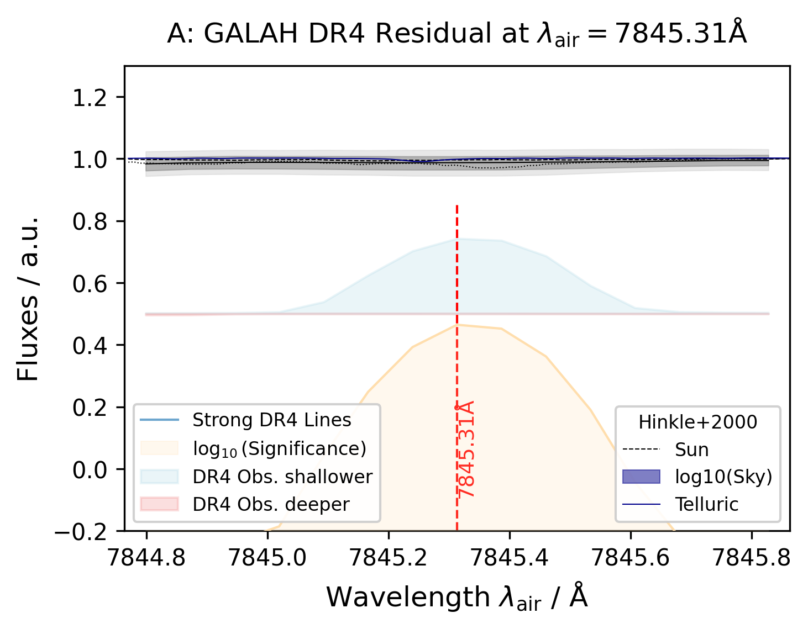
      <br><strong>A. log(gf) too high</strong>
    </td>
    <td width="33%" valign="top">
      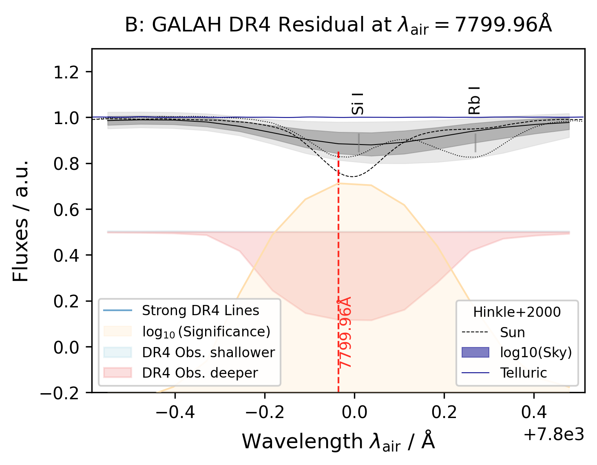
      <br><strong>B. log(gf) too low</strong>
    </td>
    <td width="33%" valign="top">
      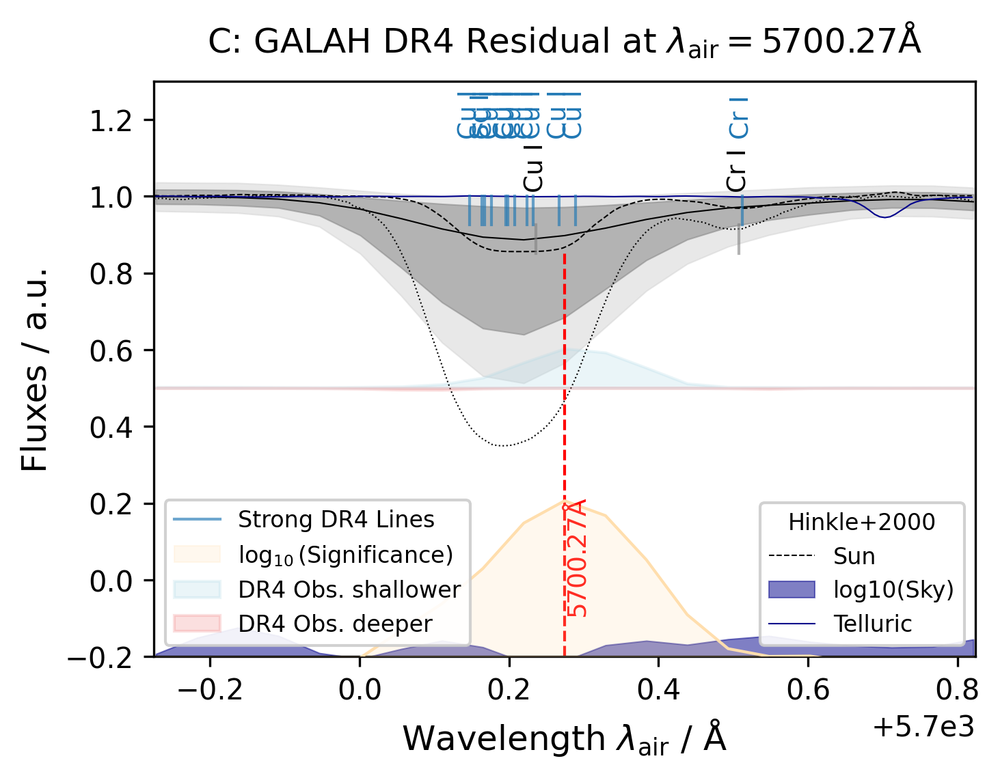
      <br><strong>C. Line profile</strong>
    </td>
  </tr>
  <tr>
    <td width="33%" valign="top">
      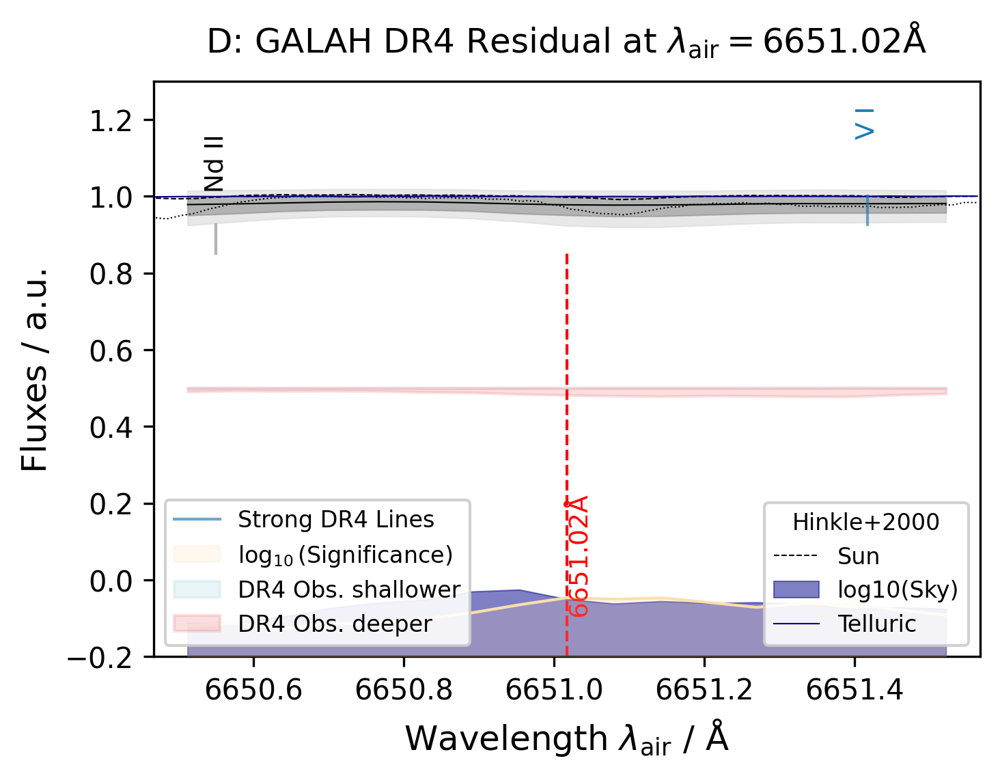
      <br><strong>D. Insignificant</strong>
    </td>
    <td width="33%" valign="top">
      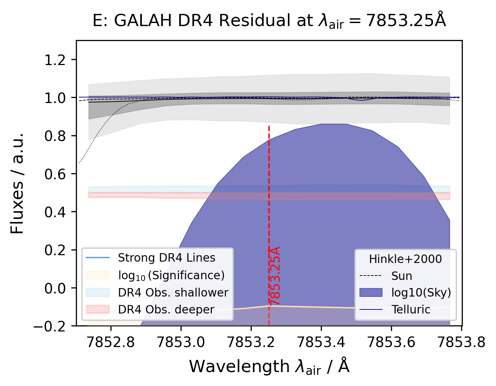
      <br><strong>E. Skyline</strong>
    </td>
    <td width="33%" valign="top">
      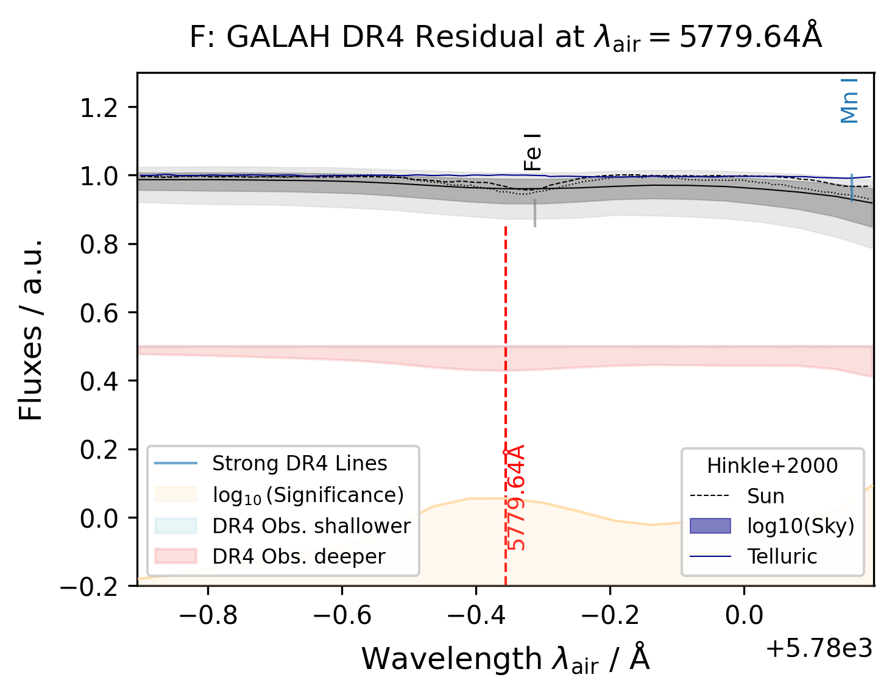
      <br><strong>F. Interstellar</strong>
    </td>
  </tr>
  <tr>
    <td width="33%" valign="top">
      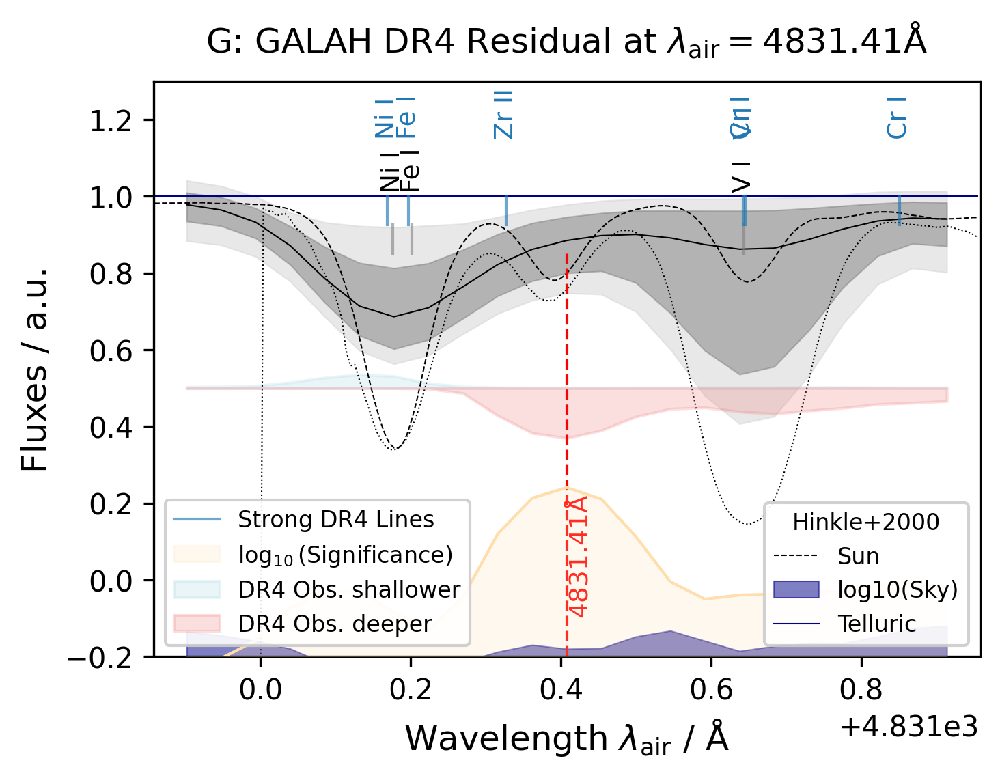
      <br><strong>G. Unknown line</strong>
    </td>
    <td width="33%" valign="top">
      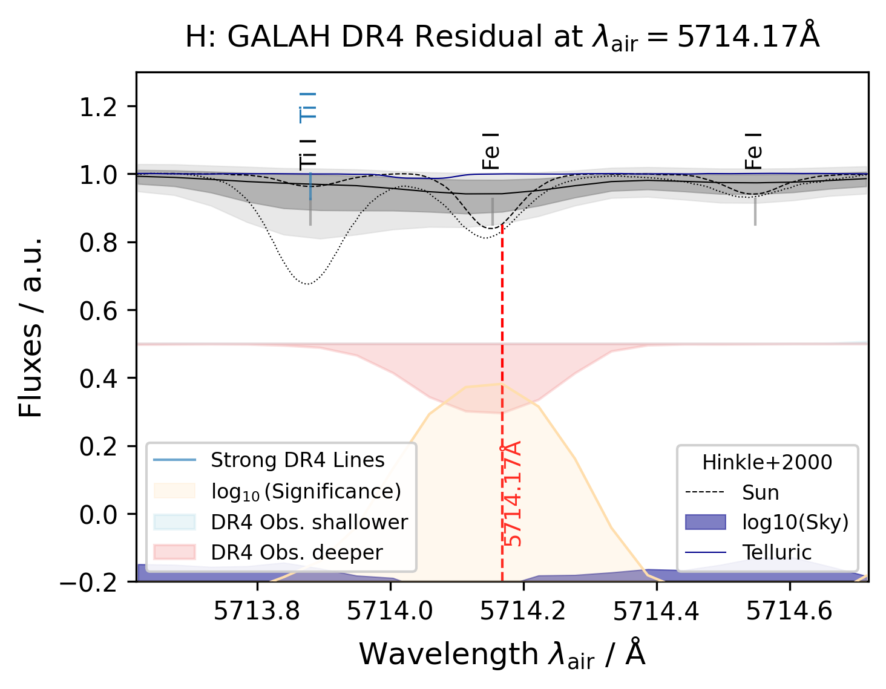
      <br><strong>H. Known missing</strong>
    </td>
    <td width="33%" valign="top">
      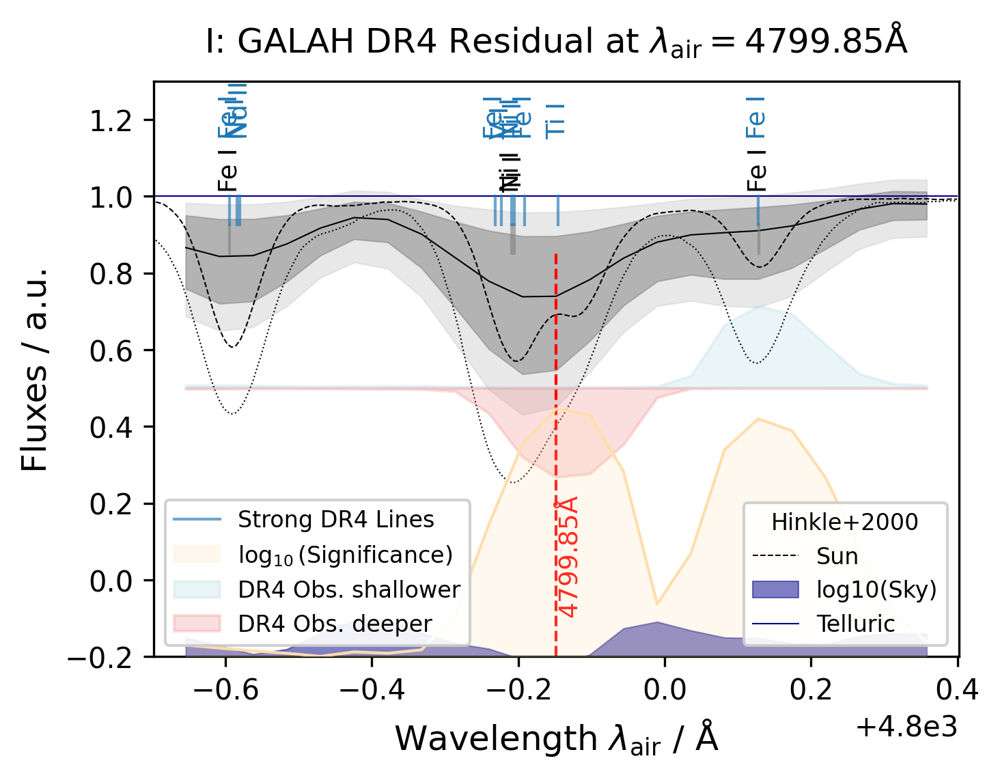
      <br><strong>I. Unclear</strong>
    </td>
  </tr>
</table>

The complete set of diagnostic plots is available in [`residual_inspection/`](residual_inspection/).

## Repository contents

| Path                                                                 | Description                                                                                                                                                       |
| -------------------------------------------------------------------- | ----------------------------------------------------------------------------------------------------------------------------------------------------------------- |
| [`data/peak_inspection_table.fits`](data/peak_inspection_table.fits) | Machine-readable catalogue of the 380 residual regions, including measurements, classifications, possible identifications, and inspection comments.               |
| [`residual_inspection/`](residual_inspection/)                       | Individual diagnostic figures for all residual regions.                                                                                                           |
| [`figures/`](figures/)                                               | Main paper figures and supplementary recovery and coefficient plots.                                                                                              |
| Analysis scripts and notebooks                                       | Code used to calculate residual statistics, identify recurrent regions, train and evaluate the residual models, inspect possible causes, and produce the figures. |
| Manuscript source                                                    | LaTeX source and supporting files for the paper submitted to *The Open Journal of Astrophysics*.                                                                  |

## Data products

The principal data product is:

```text
data/peak_inspection_table.fits
```

This table contains the full residual-region catalogue. It is intended to support:

* investigations of missing or inaccurate atomic data;
* comparisons with alternative spectral-synthesis pipelines;
* searches for unidentified stellar absorption features;
* studies of interstellar absorption;
* identification of telluric, sky, and reduction residuals;
* prioritisation of wavelength regions for future improvements to spectral models.

The classifications should be treated as informed plausibility assessments. Users interested in an individual region should consult both the table comments and the corresponding diagnostic plot in `residual_inspection/`.

We further provide all models of **The Cannon** within `models/`.

## Citation

The paper is currently in preparation. Please use the following placeholder until the final journal citation and DOI are available:

```bibtex
@ARTICLE{Buder2026ResidualCannon,
    author        = {{Buder}, Sven and
                     {R{\'o}{\.z}{\'a}{\'n}ski}, Tomasz and
                     {Hogg}, David W.},
    title         = "{Reading Between the Lines: How Much Information Remains After Fitting a Stellar Spectrum?}",
    journal       = {The Open Journal of Astrophysics},
    year          = {2026},
    volume        = {TBD},
    number        = {TBD},
    pages         = {TBD},
    doi           = {TBD},
    eprint        = {TBD},
    archivePrefix = {arXiv},
    primaryClass  = {astro-ph.SR}
}

```
